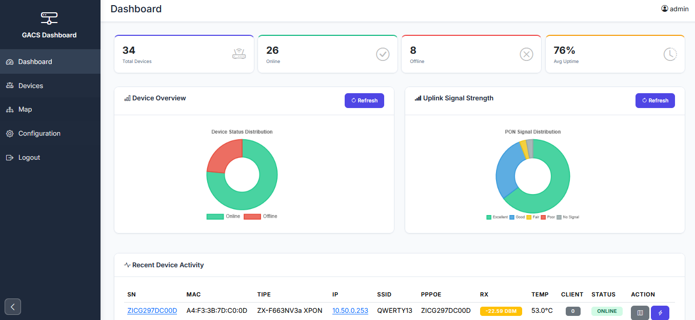
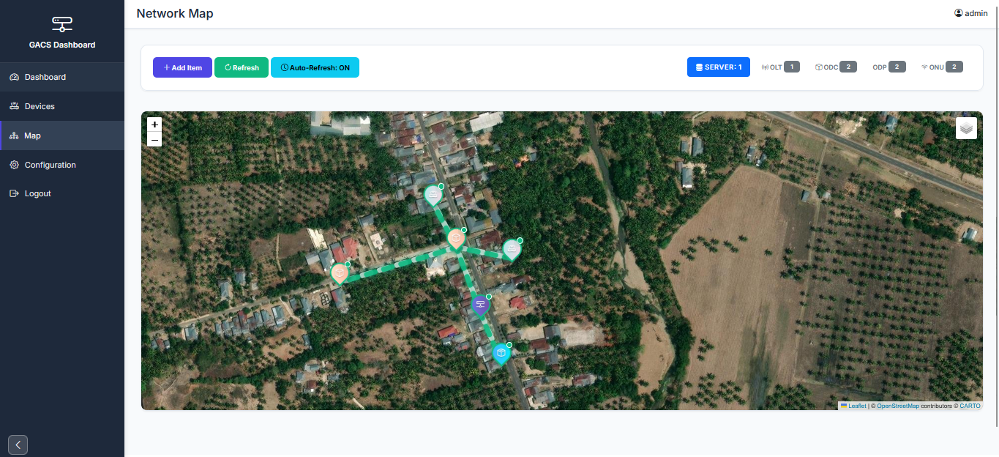

# GACS Dashboard

<div align="center">


**Dashboard Monitoring & Topologi Jaringan GenieACS**

Dashboard berbasis web yang powerful untuk memonitor dan memvisualisasikan topologi jaringan GenieACS Anda.

[Fitur](#fitur) • [Instalasi](#instalasi) • [Konfigurasi](#konfigurasi) • [Screenshot](#screenshot)

</div>

---

## Daftar Isi

- [Gambaran Umum](#gambaran-umum)
- [Fitur](#fitur)
- [Kebutuhan Sistem](#kebutuhan-sistem)
- [Instalasi](#instalasi)
- [Konfigurasi](#konfigurasi)
- [Kredensial Default](#kredensial-default)
- [Screenshot](#screenshot)
- [Kontribusi](#kontribusi)
- [Dukungan](#dukungan)
- [Lisensi](#lisensi)

---

## Gambaran Umum

GACS Dashboard adalah alat monitoring jaringan dan visualisasi topologi yang dibangun untuk GenieACS. Dashboard ini menyediakan antarmuka yang intuitif untuk memonitor dan mengelola infrastruktur jaringan Anda dengan visualisasi data secara real-time.

> **Catatan:** Proyek ini saat ini masih dalam tahap **beta testing**. Silakan laporkan jika Anda menemukan masalah.

---

## Fitur

- ✅ Monitoring jaringan secara real-time
- ✅ Visualisasi topologi interaktif
- ✅ Antarmuka web yang user-friendly
- ✅ Integrasi dengan GenieACS
- ✅ Dashboard yang dapat dikustomisasi
- ✅ Desain responsif

---

## Kebutuhan Sistem

Sebelum instalasi, pastikan Anda memiliki:

- Web server (Apache/Nginx)
- PHP 8+
- MySQL 5.7 atau lebih tinggi
- PHP Composer
- Instance GenieACS (untuk integrasi data)

---

## Instalasi

### Langkah 1: Download

Download file ZIP rilis terbaru dari halaman releases.

### Langkah 2: Upload ke Hosting

Ekstrak dan upload semua file ke direktori web hosting Anda (misalnya `public_html` atau `www`).

### Langkah 3: Import Database

Import file `database.sql` ke database MySQL Anda:

```bash
mysql -u nama_user_anda -p nama_database_anda < database.sql
```

Atau gunakan phpMyAdmin:
1. Buka phpMyAdmin
2. Pilih database Anda
3. Klik tab "Import"
4. Pilih file `database.sql`
5. Klik "Go"

---

## Konfigurasi

### 1. Konfigurasi URL Aplikasi

Edit file konfigurasi yang terletak di:

```
config/config.php
```

Perbarui bagian `APP_URL` dengan domain Anda:

```php
define('APP_URL', 'https://gacs.example.com');
```

Ganti `https://gacs.example.com` dengan domain atau alamat IP Anda yang sebenarnya.

### 2. Konfigurasi Database

Edit file konfigurasi database:

```
config/database.php
```

Perbarui kredensial database:

```php
// Konfigurasi Database
define('DB_HOST', 'localhost');        // Host database Anda
define('DB_USER', 'root');              // Username database Anda
define('DB_PASS', '');                  // Password database Anda
define('DB_NAME', 'gacs-dev');          // Nama database Anda
```

**Contoh untuk produksi:**

```php
define('DB_HOST', 'localhost');
define('DB_USER', 'user_db_anda');
define('DB_PASS', 'password_aman_anda');
define('DB_NAME', 'gacs_production');
```

---

## Kredensial Default

Setelah instalasi, Anda dapat login menggunakan kredensial berikut:

| Field    | Value        |
|----------|--------------|
| Username | `user1234`   |
| Password | `mostech`    |

> **⚠️ Peringatan Keamanan:** Harap ubah password default segera setelah login pertama kali!

---

## Screenshot

Berikut adalah preview tampilan dari GACS Dashboard:

### Dashboard Utama


### Halaman Device


### Peta Topologi Jaringan


### Detail Device


---

## Kontribusi

Kontribusi sangat diterima! Jika Anda ingin berkontribusi:

1. Fork repository ini
2. Buat branch baru (`git checkout -b fitur/FiturAnda`)
3. Commit perubahan Anda (`git commit -m 'Menambahkan fitur tertentu'`)
4. Push ke branch (`git push origin fitur/FiturAnda`)
5. Buka Pull Request

---

## Dukungan

Jika Anda mengalami masalah atau memiliki pertanyaan:

- Buka issue di repository ini
- Hubungi tim pengembang
- Periksa dokumentasi di file-file proyek

---

## Lisensi

Proyek ini dilisensikan di bawah Lisensi MIT - lihat file LICENSE untuk detail lebih lanjut.

---

<div align="center">

**Dibuat dengan ❤️ untuk Administrator Jaringan**

</div>
