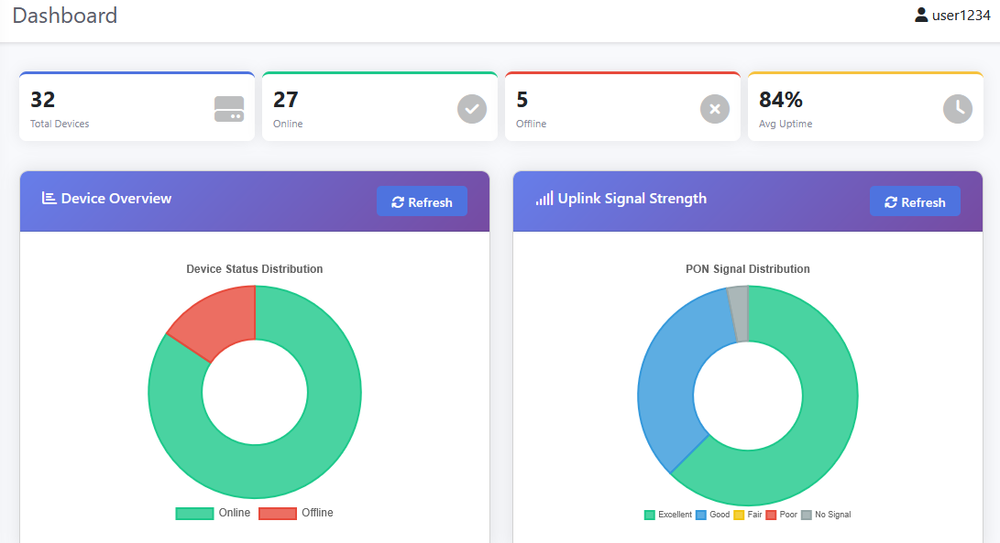
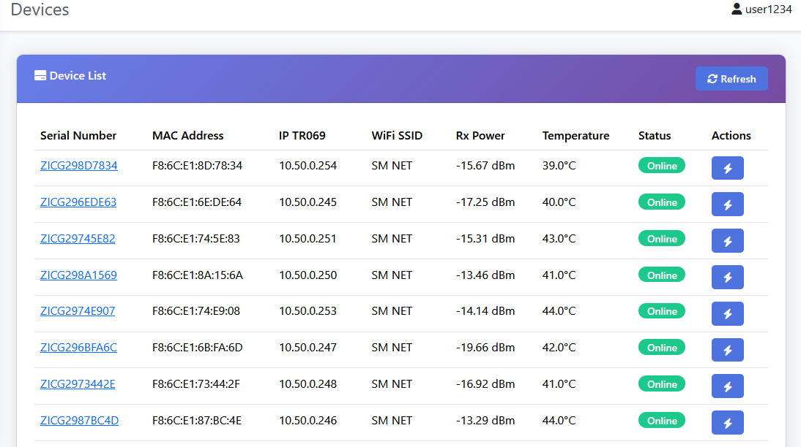
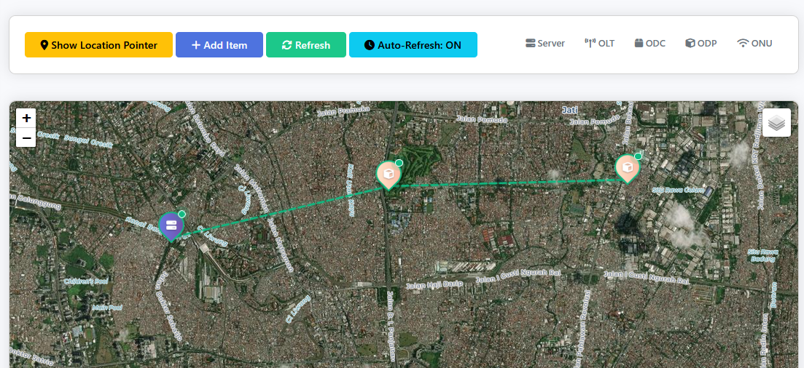

# GACS Dashboard v1.1.0-beta

<div align="center">


**GenieACS Network Monitoring Dashboard dengan Visualisasi Topologi**

Dashboard berbasis web yang powerful untuk memonitor dan memvisualisasikan topologi jaringan GenieACS dengan real-time monitoring, editable polylines ( Garis ), dan terintegrasi Telegram.

</div>

---

## ⭐ Minta Bintang Om

- Jiki birkiniin tiling tinggilin binting (⭐) im


---
---

## ➤ Telegram Sharing Group Support

- https://t.me/+QDz9bvRUZ95hZGY1

---

## 🖥️ Requirements
**Mandatorily Required**

- [GenieACS](https://github.com/safrinnetwork/GACS-Ubuntu-22.04) yang sudah terinstall, jika belum punya silahkan install dulu, bisa langsung ke [GACS-Ubuntu](https://github.com/safrinnetwork/GACS-Ubuntu-22.04) untuk panduan lengkap cara install.
- MikroTik yang aktif port api
- Telegram Bot (optional, untuk notifications dan preview singkat)


**Server Requirements**

- Web server : `Apache 2.4+ atau Nginx 1.2+`
- PHP : `8.3+`
- MySQL/MariaDB : `5.7+ / 10.3+`
- Composer : `2.8+`
- PHP Extensions: php-mysqli, php-json, php-curl, php-mbstring, php-xml

> **Note** : supaya lebih mudah install panel hosting manager saja seperti  **CloudPanel**, **Aapanel**, atau **CyberPanel**.


---

## 🚀 Quick Installation

### `Step 1` Upload & Extract


- Upload file ZIP GACS-dashboard-main.zip ke hosting
- Unzip GACS-dashboard-main.zip
- Copy semua file yang ada di folder GACS-dashboard-main ke root directory hosting
- Edit file config/database.php sesuaikan dengan database hosting
- Edit config/config.php

> **Note** : untuk folder root biasanya folder root hosting ada di **public_html**, **htdocs**, atau **httpdocs** tergantung dari panel hosting manager.


### `Step 2` Init Task

1. Akses domain kamu nama `https://domain.com/init.php`
2. Login ke init.php dengan user berikut
    - username : `user1234`
    - password : `mostech`


3. Selesaikan perintah yang ada di init.php


4. ⚠️ **HAPUS FILE INIT JIKA SUDAH SELESAI**

### `Step 3` Testing

1. Buka browser: `https://domain.com`
2. Login dengan kredensial default
   - Username: `user1234`
   - Password: `mostech`
3. ⚠️ **SEGERA GANTI PASSWORD DEFAULT!**

---

## ⚙️ Configuration

### 1. GenieACS Integration / Tab ACS Config

1. Host : Isi dengan GenieACS ip/domain
2. Port : Isi dengan port api GenieACS (7557)
3. Username : Isi dengan username GenieACS
4. Password : Isi dengan password GenieACS
5. Test Connection, jika berhasil lanjut save


### 2. MikroTik / Tab MikroTik Config

1. Host : Isi dengan MikroTik ip/domain
2. Port : Isi dengan port api MikroTik (7557)
3. Username : Isi dengan username MikroTik
4. Password : Isi dengan password MikroTik
5. Test Connection, jika berhasil lanjut save


### 3. Telegram / Tab Bot Config

1. Buat bot dulu di [@BotFather](https://t.me/BotFather)
2. Bot Token : Isi bot token dari [@BotFather](https://t.me/BotFather)
3. Chat ID : Isi chat id dari akun telegram kalian, untuk mendapatkan chat id bisa ke bot [@Chat I'd Info Bot](https://t.me/ChatidinfoBot)
4. Set webhook 

```bash
curl "https://api.telegram.org/bot<TOKEN>/setWebhook?url=https://your-domain.com/webhook/telegram.php"
```


---

## 📸 Screenshots

### Login Page


### Dashboard



### Device List



### Device Detail - Part 1


### Device Detail - Part 2


### Network Topology Map



### Configuration Menu


---

## 🤝 Contributing

Contributions are welcome! If you'd like to contribute:

1. Fork repository
2. Create feature branch (`git checkout -b feature/AmazingFeature`)
3. Commit changes (`git commit -m 'Add some AmazingFeature'`)
4. Push to branch (`git push origin feature/AmazingFeature`)
5. Open Pull Request

**Guidelines:**

- Follow existing code style
- Write clear commit messages
- Test your changes thoroughly
- Update documentation if needed

---

## 📞 Support

If you encounter issues or have questions:

- 📝 **Issues:** Open issue di GitHub repository
- 📖 **Documentation:** See complete documentation files above
- 🔍 **Troubleshooting:** Check troubleshooting section
- 💬 **Community:** Join discussion di GitHub Discussions
- ➤ **Telegram:** Join telegram sharing group

---

## 📄 License

This project is licensed under the **MIT License** - see LICENSE file for details.

---

## 🙏 Credits

**Developed by** Mostech

**Special Thanks**

- GenieACS community
- Leaflet.js team
- All contributors and testers

---

<div align="center">

**Dibuat dengan ❤️ untuk Network Administrators**

[⬆ Back to Top](#gacs-dashboard-v100-beta)

---

**GACS Dashboard v1.1.0-beta** | **Status: Production Ready** ✅

</div>
